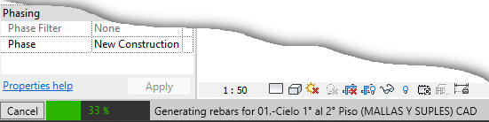
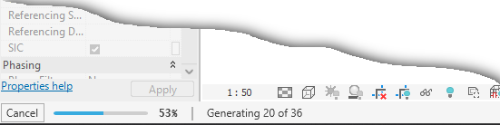

# SCADtools.Revit.UI.ProgressMeter
Represents a progress bar that will be displayed in the Revit status bar.

It has methods similar to the AutoCAD ProgressMeter class such as: Start(), Stop(), SetLimit(), MeterProgress().

## ProgressMeter in Revit 2023

## ProgressMeter in Revit 2024

