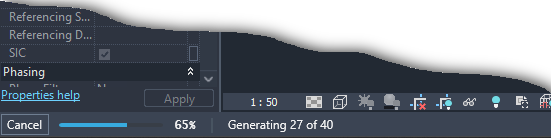

# SCADtools.Revit.UI.ProgressMeter
Represents a progress bar that will be displayed in the Revit status bar.

It has methods similar to the AutoCAD ProgressMeter class such as: Start(), Stop(), SetLimit(), MeterProgress().

With the ProgressMeter library, you can easily integrate a progress bar into the Revit interface to keep the user informed about an ongoing process. Below, you'll find some examples of what this progress bar looks like in action.

## ProgressMeter in Revit 2023

## ProgressMeter in Revit 2024

