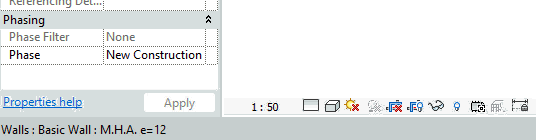
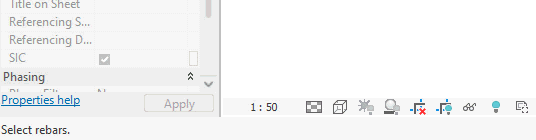
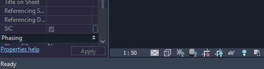

# SCADtools.Revit.UI.ProgressMeter
Represents a progress bar that will be displayed in the Revit status bar.

It has methods similar to the AutoCAD ProgressMeter class such as: **Start()**, **Stop()**, **SetLimit()**, **MeterProgress()**.

With the ProgressMeter library, you can easily integrate a progress bar into the Revit interface to keep the user informed about an ongoing process. Below, you'll find some examples of what this progress bar looks like in action.

You can reference the DLL in a Visual Studio project the same way you load any external library. The DLL files corresponding to each version of Revit are as follows:

- [ProgressMeter for Revit 2023](./rvt2023/SCADtools.Revit.UI.ProgressMeter.dll)

- [ProgressMeter for Revit 2024](./rvt2024/SCADtools.Revit.UI.ProgressMeter.dll)

## ProgressMeter in Revit 2023


## ProgressMeter in Revit 2024
**Light Theme**



**Dark Theme**



## Code example
```c#
using System.Collections.Generic;
using Autodesk.Revit.Attributes;
using Autodesk.Revit.DB;
using Autodesk.Revit.UI;
using SCADtools.Revit.UI;
using System.Linq;
using System;

namespace SCADtools.ProgressMeterSample
{
    [TransactionAttribute(TransactionMode.Manual)]
    internal class Sample : IExternalCommand
    {
        public Result Execute(ExternalCommandData commandData, ref string message, ElementSet elements)
        {
            UIApplication uiapp = commandData.Application;
            UIDocument uidoc = uiapp.ActiveUIDocument;
            Document doc = uidoc.Document;

            //Initialize ProgressMeter
            //By default the cancel button will be displayed
            //If you don't want to show the cancel button, you must initialize it by passing false as an argument in the constructor
            ProgressMeter progressMeter = new ProgressMeter();

            try
            {
                List<Wall> walls = new FilteredElementCollector(doc)
                                            .WhereElementIsNotElementType()
                                                .OfClass(typeof(Wall))
                                                    .Cast<Wall>()
                                                        .ToList();

                int count = walls.Count;

                if (count > 0)
                {
                    //Set limit number
                    progressMeter.SetLimit(count);

                    //Initialize and make it visible (no display string)
                    progressMeter.Start();

                    using (Transaction tr = new Transaction(doc, "ProgressMeter - Updating Wall comments"))
                    {
                        tr.Start();

                        int i = 1;

                        foreach (Wall wall in walls)
                        {
                            //Set display string to be displayed to user
                            //If the display string is static it can be assigned in the Start() method of the ProgressMeter class
                            progressMeter.DisplayString = "Updating wall comments " + i.ToString() + " of " + count.ToString();

                            //Increment Progress Meter
                            progressMeter.MeterProgress();

                            //Update comments
                            Parameter parameter = wall.get_Parameter(BuiltInParameter.ALL_MODEL_INSTANCE_COMMENTS);
                            parameter.Set("Comment " + i.ToString());

                            //If the cancel button is pressed
                            if (progressMeter.StopWorker) break;

                            i++;
                        }

                        tr.Commit();
                    }
                }

                return Result.Succeeded;
            }
            catch (Exception ex)
            {
                message = ex.Message;
                return Result.Failed;
            }
            finally
            {
                //Stop and hide the ProgressMeter (IMPORTANT)
                progressMeter.Stop();
            }
        }
    }
}
```
